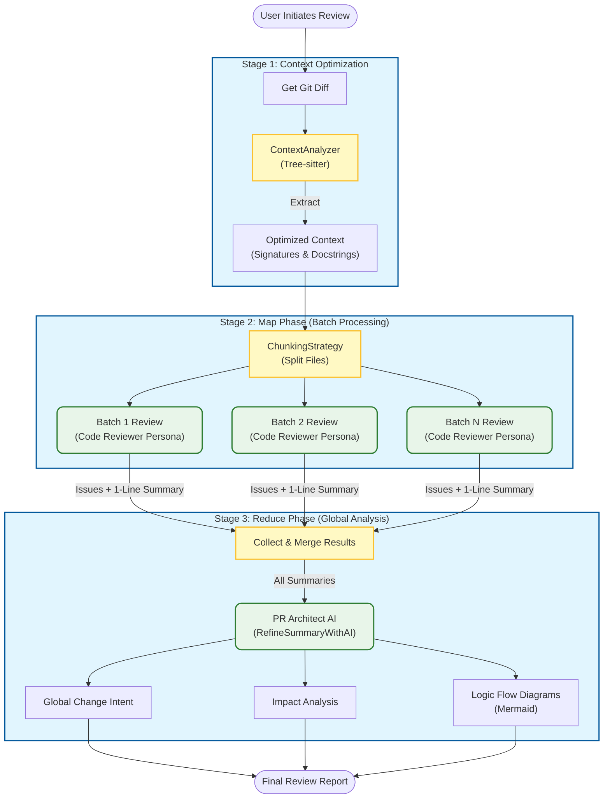

# HighReview

> 🚀 **AI-Native Local review tool** with GitHub-Style Interface

HighReview는 로컬 환경을 방해하지 않으면서 GitHub Pull Request를 강력하게 리뷰할 수 있는 도구입니다. Git Worktree를 활용하여 현재 작업 디렉토리를 건드리지 않고, **Offline-First 코드 분석**과 **Local AI**를 통해 안전하고 강력한 리뷰 환경을 제공합니다.

> 🔒 **로그인 불필요**: HighReview는 사용자의 로컬 `gh` 클라이언트와 AI 에이전트를 직접 활용하므로, 별도의 회원가입이나 인증 절차 없이 즉시 사용할 수 있습니다.

HighReview is a powerful local PR review tool that doesn't disrupt your working environment. Using Git Worktree, it provides IDE-level code analysis and AI insights without touching your current working directory.

> 🔒 **No Login or Authentication Required**: HighReview operates entirely locally using your existing `gh` client and local AI agents. No separate account or sign-up is needed.

**[View on GitHub](https://github.com/HighGarden-Studio/HighReview)** | **[Report Bug](https://github.com/HighGarden-Studio/HighReview/issues)** | **[Request Feature](https://github.com/HighGarden-Studio/HighReview/issues/new)**

[](https://opensource.org/licenses/Apache-2.0)
[](https://nodejs.org)
[](https://github.com/HighGarden-Studio/HighReview)


## ✨ Features

### 🚀 Zero Distraction Review

- **Git Worktree Integration**: Creates isolated review environments instantly.
- **Background Indexing**: Pre-indexes symbols for instant code navigation.
- **IDE-Like Experience**: Go to Definition, Find Usages, and Symbol Search (TypeScript, Ruby, Java).

### 🤖 Universal AI Provider

Plug-and-play AI support. No API keys required for local models.

- **Supported Providers**:
  - **Claude Code CLI** (Recommended, Anthropic)
  - **Ollama** (Local Llama 3, Mistral, etc.)
  - **LM Studio** (Local, OpenAI Compatible)
- **Automatic Detection**: Automatically detects installed providers.
- **Zero Configuration**: Select your provider in the UI Settings.

### 💬 AI Assistant (Context-Aware Chat)

Ask questions about your code with full context awareness.

- **Smart Context**: Automatically includes selected code, file contents, and PR details.
- **Deep Analysis**: "Explain this function", "Find bugs in this selection", "Generate tests".
- **Multi-Modal**: Supports file attachments and reference links.

### 📊 Comprehensive Code Analysis

- **Automatic Issue Detection**: Critical bugs, warnings, and optimization suggestions.
- **Change Intent Analysis**: Understand _why_ code was changed.
- **Impact Analysis**: See potential side effects and breaking changes.
- **Visual Call Stacks**: Interactive Mermaid flowcharts and sequence diagrams.

## 🏗️ Architecture

```
HighReview/
├── apps/
│   ├── cli/          # Node.js Backend (Fastify + SQLite + Tree-sitter)
│   └── web/          # React Frontend (Vite + Monaco + React Query)
└── .highreview/      # Global Config & Storage
```

### AI Review Pipeline



## 🛠 Tech Stack

**Backend (CLI)**

- **Runtime**: Node.js 18+
- **Framework**: Fastify
- **Database**: SQLite (`better-sqlite3`) for robust local storage.
- **Analysis**: Tree-sitter (Java, TS, Ruby, Python, Kotlin) for precise code parsing.
- **AI Integration**: Custom Provider Architecture (Claude, Ollama, LM Studio).

**Frontend (Web)**

- **Framework**: React 18, Vite
- **Editor**: Monaco Editor (VS Code core)
- **State**: React Query, Zustand
- **UI**: Allotment (Splits), TailwindCSS, Radix UI
- **Visualization**: Mermaid.js for flows and charts.

## 🚀 Getting Started

### Prerequisites

- **Node.js**: >= 18.0.0
- **Git**: >= 2.30.0
- **GitHub CLI**: `gh auth login` required for PR fetching.
- **AI Provider** (Optional but Recommended):
  - [Claude Code](https://claude.ai/download)
  - [Ollama](https://ollama.ai)

### Installation

1. **Clone the repository**

   ```bash
   git clone https://github.com/HighGarden-Studio/HighReview.git
   cd HighReview
   ```

2. **Install dependencies**

   ```bash
   npm install
   ```

3. **Start Development Server**

   ```bash
   # Starts both CLI (port 8765) and Web (port 5273)
   npm run dev
   ```

4. **Open in Browser**
   - Go to `http://localhost:5273`
   - **Settings Setup**: Navigate to the Settings page to select your AI Provider.


## 📖 Usage Guide

### 1. Select a Pull Request

Review-requested PRs are automatically loaded. Click any card to start a workspace-isolated review.


#### 2. AI Review Options

When re-running a review, you can customize the analysis depth:

- **🧠 Context-Aware Review**: Uses Tree-sitter to find callers and implementations of modified code in the project.
- **🎯 Change Intent Analysis**: Determines _why_ code was changed (File-level or Block-level).
- **📊 Code Visualization**: Generates Mermaid Flowcharts or Sequence Diagrams or Class Diagrams for modified functions.
- **🔍 Impact Analysis**: Assesses broader impact (Module, Project, or Dependencies).
- **✨ Semantic Diff**: Detects moved code, refactoring patterns, and ignores whitespace/comments.
- **💬 Custom Prompt**: Add your own specific instructions for the AI reviewer.


### 3. Review with AI

- **Auto-Review**: The AI analyzes the PR on load. Click "Re-run" to trigger a fresh analysis with custom options.
- **Ask Assistant**: Highlight any code in the specialized "Diff Editor" or "File Tree" and ask questions in the side panel.


### 4. Navigate Code

- **Go to Definition**: Right-click on symbols (even in Ruby/Java) to jump to their definition.
- **Find Usages**: See where functions or classes are used across the PR.

## 📄 License

This project is licensed under the **Apache License 2.0** - see the [LICENSE](LICENSE) file for details.

---

Made with ❤️ by [HighGarden Studio](https://github.com/HighGarden-Studio)
